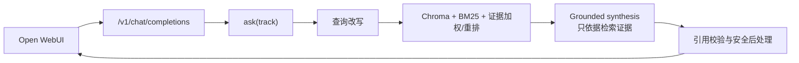

# 证据智能助手 MVP

OpenEvidence 风格的三赛道证据助手：临床证据助手、健康营养助手、RAG vs 通用大模型对比评测。

> **伦理边界**：仅供学习与演示，**不构成医疗建议**，不用于真实诊疗，不处理真实患者隐私。引用请人工复核。

## 先看结论

- **Open WebUI 主前端**：`http://127.0.0.1:8080/`（证据台）；Windows 一键：`.\scripts\start_openwebui.ps1`
- **自定义网站**（3D 首页 + ReAct 咨询 + 评测仪表盘）：`python run_web.py` → `http://127.0.0.1:8000/`
- 两套前端共用同一后端：`src.app.web_server`（`api.py` 与其指向同一 app）
- Open WebUI 通过 `GET /v1/models`、`POST /v1/chat/completions` 接入；自定义页用 `POST /api/chat`、`POST /ask`
- Open WebUI 中的 `evidence-clinical` / `evidence-nutrition` 对应赛道一/二，Prompt 与 RAG 由后端统一控制

## 团队协作文档

任务分配、流程图、时序图、架构与函数接口清单见：

- [docs/团队任务与架构说明.md](docs/团队任务与架构说明.md)

**待完善接口已分散到各业务模块文件末尾**（格式：函数签名 + 中文备注 + `NotImplementedError`），不再使用集中式 stubs 文件。认领时直接打开对应 `.py` 搜索「【待完善】」。

## 功能概览

| 赛道 | 说明 |
|------|------|
| 一 · 临床 | 专业结构化回答 + 证据面板 + 引用校验 |
| 二 · 营养 | 通俗科普改写 + 同一知识库可追溯引用 |
| 三 · 评测 | Baseline（纯 LLM）vs RAG 假引用/覆盖率对比 |

共用底座：PubMed / ClinicalTrials.gov / Europe PMC / 本地种子摘要 → 切分 → Chroma → 混合检索 → 带引用生成。

主前端使用 Open WebUI，但 RAG 的唯一事实来源仍是本项目后端：Open WebUI 只负责聊天、
模型选择和 Markdown/SSE 渲染；`/v1/chat/completions` 内部会继续执行查询改写、A 组
知识库混合检索、基于检索证据的生成和引用校验。

## 快速开始（换到其他电脑）

```bash
cd /path/to/evidence-assistant-mvp

# 项目后端环境；环境名是跨电脑通用的，不依赖某台机器的绝对路径
conda create -y -n evidence_mvp python=3.12 pip
conda run -n evidence_mvp \
  python -m pip install -r requirements.txt

# Open WebUI 主前端环境
conda create -y -n open_webui python=3.11 pip
conda run -n open_webui python -m pip install open-webui

# 可选：复制无密钥模板；也可以跳过，启动后在设置页填写连接信息
cp .env.example .env

# 启动后端 + Open WebUI
bash scripts/start_openwebui.sh
```

浏览器打开 [http://127.0.0.1:8080/](http://127.0.0.1:8080/)，进入用户菜单的
“设置 → 通用”，在“证据模型连接”卡片中填写 API Base URL、API Key、模型名和协议，
保存后立即生效，不需要编辑 `.env`。`/settings` 仍保留为不依赖 Open WebUI 设置弹窗的备用页。

模型选择与供应商配置是两件事：

| Open WebUI 模型 | 对应赛道 | 使用场景 |
|---|---|---|
| `evidence-clinical`（赛道一 · 临床证据） | 临床证据 | 指南、系统综述、RCT、适用人群与局限 |
| `evidence-nutrition`（赛道二 · 健康营养） | 健康营养 | 生活方式、膳食和营养研究的通俗解释 |

“证据模型连接”里的 API Base URL 是**远程模型供应商地址**，不是本机
`http://127.0.0.1:8000`。本机后端地址由启动脚本自动注入 Open WebUI；通常只需要选择协议、填写供应商地址、模型名和 API Key，然后点击连接测试/保存。

如果看不到这张卡片，可打开备用设置页：
`http://127.0.0.1:8000/settings`。保存后重试聊天即可，服务不需要重新构建。

配置优先级为：**设置页保存的本机运行时配置 > 项目 `.env` > 离线默认值**。因此，如果之前已经在页面保存过其他供应商，单纯修改 `.env` 可能不会立即生效；在设置页执行“恢复 `.env`/默认配置”或调用本机的 `POST /api/settings/reset` 后，再重启服务即可。macOS 默认运行时文件位于：
`~/Library/Application Support/evidence-assistant-mvp/llm_runtime.json`；文件权限会限制为当前用户可读写。

设置页的“测试连接”只请求供应商的模型列表接口，不会发送真实问题；连接测试通过后，再用一个赛道问题验证完整 RAG 和流式回答。

如果希望使用文件配置，也可以编辑 `.env`，按 ByeAPI 的 OpenAI Responses 接口填写：

```env
LLM_API_FORMAT=responses
LLM_API_KEY=你的 ByeAPI token
LLM_BASE_URL=https://api.byeapi.top
LLM_MODEL=gpt-5.6-luna
# 关闭额外推理强度调节，避免增加等待时间；赛道策略由后端统一控制
LLM_REASONING_EFFORT=
RAG_USE_LLM_RERANK=false
RAG_USE_LLM_QUERY_REWRITE=false
EMBEDDING_MODE=local
```

ByeAPI 的 Responses Base URL 保持根地址，客户端会请求 `/v1/responses`。如果可用渠道
页面上的模型 ID 有变化，只改 `.env` 的 `LLM_MODEL`；切换到 Chat Completions 服务时，把
`LLM_API_FORMAT` 改为 `openai`，并按服务商要求修改 `LLM_BASE_URL`、`LLM_MODEL`，不用改
前端或 RAG 代码。

ByeAPI Responses 不保证提供本项目所需的 Embeddings，因此 `EMBEDDING_MODE=local` 会
使用本地哈希向量并让中文 bigram BM25 负责关键词召回；这样 ByeAPI 只需要一个 token。

### DeepSeek 直连

设置页的“服务商预设”提供 DeepSeek V4 Flash 和 V4 Pro。DeepSeek 官方提供
OpenAI-compatible 接口，直连时使用 `https://api.deepseek.com`，模型 ID 使用
`deepseek-v4-flash` 或 `deepseek-v4-pro`；项目会自动把 Embedding 切到本地，避免把
同一个 DeepSeek Key 误用于不适配的向量接口。具体模型与接口以
[DeepSeek 官方文档](https://api-docs.deepseek.com/zh-cn/)为准。

```env
LLM_API_FORMAT=openai
LLM_API_KEY=你的 DeepSeek API Key
LLM_BASE_URL=https://api.deepseek.com
LLM_MODEL=deepseek-v4-flash
EMBEDDING_MODE=local
```

未配置有效 key 时会进入**离线占位模式**（哈希 embedding + 模板回答），仍可演示全流程。

交互请求默认使用本地词法查询扩展、中文 Bigram BM25/向量混合排序和证据等级加权，
不额外调用查询改写和候选重排 LLM，因此只需等待一次最终回答生成。如需启用预置的
远程 query reformulation Prompt，把 `RAG_USE_LLM_QUERY_REWRITE` 改为 `true`；如需
启用二次候选重排，把 `RAG_USE_LLM_RERANK` 改为 `true`。回答响应中的 `timings_ms`
和证据面板耗时行可用于定位改写、检索、生成、引用校验分别花了多久。

设置页只保留 API 格式、Base URL、模型名和 API Key；`reasoning_effort`、temperature、
top_p、max tokens 等模型细调不在产品界面开放。Open WebUI 为协议兼容仍可能提交这些
字段，但本项目的赛道 Prompt、检索 `top_k`、引用规则和生成策略由后端固定。

### 流式输出说明

流式只影响“回答生成”阶段，不能把检索本身变成逐 token 输出。每次请求仍会先完成查询改写（默认是本地词法扩展）、A 组知识库检索和证据边界判断；随后模型开始生成，模型供应商返回的增量文本会立即转发到页面。因而首次可见正文时间主要由“检索耗时 + 模型首 token 延迟”决定，页面在等待期间会保持连接并显示生成状态。

- Responses 模式读取 `response.output_text.delta`；Chat Completions 模式读取 `delta.content`；Anthropic 模式读取 `content_block_delta`。
- 后端不会再把完整答案生成完后人为切成假分片。若供应商不支持流式，才会回退到非流式请求，并以单段内容完成回答。
- 来源不混入回答正文：流式完成后通过 Open WebUI 原生 Sources 事件发送；备用页和非流式接口仍会显示证据面板 Markdown。

如果电脑上使用的是 Conda prefix 环境而不是环境名，可这样启动，脚本仍兼容：

```bash
EVIDENCE_BACKEND_ENV=/absolute/path/to/evidence_mvp \
OPENWEBUI_ENV=/absolute/path/to/open_webui \
bash scripts/start_openwebui.sh
```

macOS/Linux 可直接执行上面的 Bash 命令；Windows 建议使用 WSL 或 Git Bash。

启动后可以先做两个不消耗模型额度的检查：

```bash
curl -fsS http://127.0.0.1:8000/health
curl -fsS http://127.0.0.1:8000/v1/models
```

终端中按 `Ctrl-C` 会同时停止本项目后端和 Open WebUI。若端口被占用，可在启动前改端口：

```bash
EVIDENCE_BACKEND_PORT=8010 OPENWEBUI_PORT=8090 \
bash scripts/start_openwebui.sh
```

此时后端为 `http://127.0.0.1:8010`，主前端为 `http://127.0.0.1:8090`；模型连接设置页会由启动脚本自动使用新的后端端口。

### 1. 构建知识库

使用仓库中已经保存的 A 组 raw 语料离线重建（不访问外网，推荐当前分支使用）：

```bash
conda run --no-capture-output -n evidence_mvp \
  python scripts/build_kb.py --skip-live --stats
```

这条命令会读取 PubMed、ClinicalTrials、Europe PMC、营养书籍 OCR、500 篇精选论文、
限钠/血压精品库等已保存 raw 文件，并重新生成 processed 数据和 Chroma。不要用
`--skip-ingest` 代替它；`--skip-ingest` 只适合 processed 数据已经确认最新的情况。

`data/chroma/` 只存本机索引，已加入 Git 忽略规则，避免把大体积 SQLite 文件上传到远程仓库；
`data/raw/` 和 `data/processed/` 才是可用于复现的语料与中间结果。新电脑第一次启动前建议先执行上面的离线构建命令，否则检索器可能没有可用的 Chroma 集合。

拉取公开数据源（需网络）：

```bash
conda run --no-capture-output -n evidence_mvp \
  python scripts/build_kb.py
```

可将 PDF / Markdown 放入 `data/raw/local/` 后重建知识库。

### 2. 冒烟测试

```bash
conda run --no-capture-output -n evidence_mvp \
  python scripts/smoke_demo.py
```

### 3. 启动统一 Web 界面 / API

```bash
# 首次准备 Open WebUI（只需执行一次）
conda create -y -n open_webui python=3.11 pip
conda run --no-capture-output -n open_webui \
  python -m pip install open-webui

# 启动后端 + 真正的 Open WebUI 主前端
bash scripts/start_openwebui.sh

# 浏览器打开 http://127.0.0.1:8080/
# 打开 Open WebUI → 设置 → 通用 → 证据模型连接配置 API Base URL、API Key、模型名和协议。
# 备用页：http://127.0.0.1:8000/settings
# 首次启动会自动合并证据台 Banner、两条赛道示例问题，并隐藏无关的 Arena Model；
# 只合并带项目标记的配置，保留现有 Open WebUI 账号的其他设置。

# FastAPI 自带证据台是无额外依赖的降级入口：http://127.0.0.1:8000/fallback
# http://127.0.0.1:8000/ 会自动跳转到 Open WebUI 主前端

# Streamlit 备用课堂界面（统一赛道一/二选择器 + 赛道三评测）
conda run --no-capture-output -n evidence_mvp \
  streamlit run src/app/ui.py

# FastAPI / Open WebUI adapter
# GET  /config/tracks
# GET  /kb/stats
# POST /ask  {"question":"...","track":"clinical","top_k":5}
# POST /ask/batch  [{"question":"...","track":"nutrition"}]
# GET  /v1/models
# POST /v1/chat/completions  （Open WebUI 使用，支持 stream=true）
# GET  /api/settings/status；POST /api/settings/update；POST /api/settings/test
# POST /eval/run
```

直接验证真实 SSE 流式（这里的 `evidence-local` 只是本机适配层令牌，不是远程供应商 Key）：

```bash
curl -N --no-buffer -sS http://127.0.0.1:8000/v1/chat/completions \
  -H 'Content-Type: application/json' \
  -H 'Authorization: Bearer evidence-local' \
  -d '{"model":"evidence-nutrition","stream":true,"messages":[{"role":"user","content":"地中海饮食对心血管风险有什么研究提示？"}]}'
```

正常结果应当是：先收到 `chat.completion.chunk` 的角色帧，随后多次收到带有
`delta.content` 的内容帧，最后收到 Sources 事件、`finish_reason=stop` 和 `data: [DONE]`。
如果只有一次完整内容，优先检查供应商是否支持当前协议的流式参数，以及 `.env` 或设置页中的协议和 Base URL 是否匹配。

Open WebUI 是主前端；本项目只提供 B 组范围内的 OpenAI-compatible 适配层，把模型选择
映射到赛道一/二，并把统一问答结果转换为 Open WebUI 能直接渲染的普通或 SSE 流式
回答。两条赛道共用同一条后端链路：`query reformulation → 混合检索 → grounded
synthesis → citation validation`。差异由系统预置 Prompt 和赛道配置控制，前端不重复
实现业务逻辑。

`BYPASS_EMBEDDING_AND_RETRIEVAL=true` 只关闭 Open WebUI 自己的重复 Embedding/RAG；它
不会关闭本项目的 `HybridRetriever`。这样一次提问只经过一条可追踪的 RAG 链路，回答
中的 `[n]` 会映射回本次检索到的标题、证据等级、年份、摘要片段和原文链接；Open WebUI
主界面通过原生 Sources 面板展示来源，备用页/非流式接口则在正文末尾显示“证据面板”。
两种展示都包含改写查询、来源/证据等级分布与引用校验状态。

Open WebUI 的项目化信息通过 [`scripts/configure_openwebui.py`](scripts/configure_openwebui.py)
合并：旧证据台的“双赛道纪律”、示例问题和“先看证据，再形成答案”会显示在主界面；
启动脚本还会执行 [`scripts/install_openwebui_bridge.py`](scripts/install_openwebui_bridge.py)，
把模型连接卡片嵌入 Open WebUI 原生“设置 → 通用”页面。桥接只注入项目自己的卡片和样式，
不修改 Open WebUI 上游源码；服务重启或 Open WebUI 升级后会自动重装。它不会复制旧版页面，
也不会覆盖 A 组知识库或用户的其他 Open WebUI 配置。



没有配置有效 `LLM_API_KEY` 时，检索、引用映射和校验仍会真实运行，但生成文本是离线
占位回答；正式演示可以在项目 `.env` 中配置可用的 ByeAPI Responses 或其他
OpenAI-compatible LLM，也可以直接使用上面的模型连接设置页保存运行时配置。

LLM 调用统一收口在 [`src/llm.py`](src/llm.py)：`LLMClient.chat()` 负责非流式的查询改写、
重排和回答生成，`LLMClient.stream_chat()` 负责回答生成阶段的上游增量消费，
`LLMClient.embed()` 负责建库/在线向量查询，配置默认来自 `.env` 的
`LLM_API_FORMAT`、`LLM_API_KEY`、`LLM_BASE_URL`、`LLM_MODEL`、`EMBEDDING_MODE` 和
`EMBEDDING_MODEL`，也可由 Open WebUI“证据模型连接”卡片（或 `/settings` 备用页）的运行时配置覆盖前四项。调用链是：
`src/app/openwebui.py` → `src/tracks/pipeline.py::ask` → 赛道改写/检索 →
`src/generation/answer.py::generate_answer` → `src/llm.py`。流式时，
`openwebui.py` 使用后台 worker 调用 `ask(..., stream_callback=...)`，避免同步等待完整回答后再切片。

RAG 数据流契约测试：

```bash
conda run --no-capture-output -n evidence_mvp \
  python -m unittest -v tests.test_rag_contract
```

完整回归测试：

```bash
conda run --no-capture-output -n evidence_mvp \
  python -m unittest discover -s tests -p 'test_*.py' -v

conda run --no-capture-output -n evidence_mvp \
  python -m compileall -q src tests scripts
```

### 常见问题

| 现象 | 处理方式 |
|---|---|
| `找不到 conda` | 先安装 Miniforge/Miniconda，并在当前终端确认 `conda --version` 可用。 |
| 后端环境缺少 `uvicorn` | 在项目目录执行 `conda run -n evidence_mvp python -m pip install -r requirements.txt`。 |
| Open WebUI 环境缺少 `open_webui` | 执行 `conda run -n open_webui python -m pip install open-webui`。 |
| 8000 或 8080 已被占用 | 使用 `EVIDENCE_BACKEND_PORT` / `OPENWEBUI_PORT` 改端口，或先停止旧的 `start_openwebui.sh`。 |
| 401/403/404 或模型无响应 | 检查设置页里的协议、Base URL、模型 ID 和 API Key；Responses 模式的 ByeAPI Base URL 填根地址，程序会自动补 `/v1/responses`。 |
| 页面能打开但没有证据 | 先执行 `scripts/build_kb.py --skip-live --stats`，再检查 `curl http://127.0.0.1:8000/kb/stats`。 |
| 页面一直等待 | 先用上面的 `curl -N --no-buffer` 检查后端 SSE；若后端有分片而页面没有，刷新 Open WebUI，启动脚本会重新安装桥接。 |
| 没有填写 Key 也能回答 | 这是预期的离线占位模式；它可以验证 RAG 和来源结构，但回答不是远程模型生成结果。 |

本次 B 组前后端实现记录见：[docs/统一助手实现记录.md](docs/统一助手实现记录.md)。

### 4. 跑评测（赛道三）

```bash
conda run --no-capture-output -n evidence_mvp \
  python scripts/run_eval.py
```

结果写入 `data/eval/results/benchmark_results.json` 与 `benchmark_summary.md`。

## 演示路径建议

1. **临床 Tab**：问「高血压为什么要长期吃药」→ 展示证据卡片与 `[n]` 引用。
2. **营养 Tab**：问「地中海饮食证据」→ 对比更通俗的表述，引用仍可点开。
3. **评测 Tab**：运行评测 → 看假引用率 / 要点覆盖柱状图 → 打开「火星尘埃」「紫水晶」等应拒答 case。

## 项目结构

```
evidence-assistant-mvp/
  src/ingest/      # 数据采集
  src/kb/          # 切分、Chroma、Wiki
  src/retrieval/   # 混合检索 + 重排
  src/generation/  # 带引用生成 / Baseline
  src/tools/       # 引用校验、在线补检索
  src/tracks/      # 三赛道逻辑与评测
  src/app/         # FastAPI + Streamlit
  scripts/         # build_kb / run_eval / smoke_demo
  data/eval/       # 测试集
```

## 数据来源

- PubMed E-utilities
- ClinicalTrials.gov Data API v2
- Europe PMC REST
- 本地种子摘要（`src/ingest/local_docs.py`）与 `data/raw/local/`

## 局限与后续

- 语料为窄领域演示集，非全科覆盖。
- 离线模式回答为占位，正式演示请配置真实 LLM/Embedding。
- 未做生产级权限、审计与患者数据隔离。
- 后续可加强：重排模型、Ragas 全量指标、指南 PDF 批量入库、MCP 工具封装。
