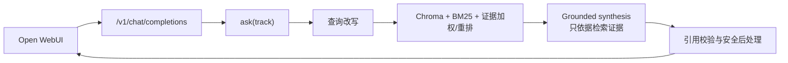

# 证据智能助手 MVP

OpenEvidence 风格的三赛道证据助手：临床证据助手、健康营养助手、RAG vs 通用大模型对比评测。

> **伦理边界**：仅供学习与演示，**不构成医疗建议**，不用于真实诊疗，不处理真实患者隐私。引用请人工复核。

## 团队协作文档

任务分配、流程图、时序图、架构与函数接口清单见：

- [docs/团队任务与架构说明.md](docs/团队任务与架构说明.md)

**待完善接口已分散到各业务模块文件末尾**（格式：函数签名 + 中文备注 + `NotImplementedError`），不再使用集中式 stubs 文件。认领时直接打开对应 `.py` 搜索「【待完善】」。

## 功能概览

| 赛道 | 说明 |
|------|------|
| 一 · 临床 | 专业结构化回答 + 证据面板 + 引用校验 |
| 二 · 营养 | 通俗科普改写 + 同一知识库可追溯引用 |
| 三 · 评测 | Baseline（纯 LLM）vs RAG 假引用/覆盖率对比 |

共用底座：PubMed / ClinicalTrials.gov / Europe PMC / 本地种子摘要 → 切分 → Chroma → 混合检索 → 带引用生成。

主前端使用 Open WebUI，但 RAG 的唯一事实来源仍是本项目后端：Open WebUI 只负责聊天、
模型选择和 Markdown/SSE 渲染；`/v1/chat/completions` 内部会继续执行查询改写、A 组
知识库混合检索、基于检索证据的生成和引用校验。

## 快速开始（换到其他电脑）

```bash
cd /path/to/evidence-assistant-mvp

# 项目后端环境；环境名是跨电脑通用的，不依赖某台机器的绝对路径
conda create -y -n evidence_mvp python=3.12 pip
conda run -n evidence_mvp \
  python -m pip install -r requirements.txt

# Open WebUI 主前端环境
conda create -y -n open_webui python=3.11 pip
conda run -n open_webui python -m pip install open-webui

# 可选：复制无密钥模板；也可以跳过，启动后在设置页填写连接信息
cp .env.example .env

# 启动后端 + Open WebUI
bash scripts/start_openwebui.sh
```

浏览器打开 [http://127.0.0.1:8080/](http://127.0.0.1:8080/)，然后点击证据台 Banner
中的“模型连接设置”，或直接打开 [http://127.0.0.1:8000/settings](http://127.0.0.1:8000/settings)。
在那里填写 API Base URL、API Key、模型名和协议，保存后立即生效，不需要编辑 `.env`。

如果希望使用文件配置，也可以编辑 `.env`，按 ByeAPI 的 OpenAI Responses 接口填写：

```env
LLM_API_FORMAT=responses
LLM_API_KEY=你的 ByeAPI token
LLM_BASE_URL=https://api.byeapi.top
LLM_MODEL=gpt-5.6-luna
LLM_REASONING_EFFORT=xhigh
RAG_USE_LLM_RERANK=false
EMBEDDING_MODE=local
```

ByeAPI 的 Responses Base URL 保持根地址，客户端会请求 `/v1/responses`。如果可用渠道
页面上的模型 ID 有变化，只改 `.env` 的 `LLM_MODEL`；切换到 Chat Completions 服务时，把
`LLM_API_FORMAT` 改为 `openai`，并按服务商要求修改 `LLM_BASE_URL`、`LLM_MODEL`，不用改
前端或 RAG 代码。

ByeAPI Responses 不保证提供本项目所需的 Embeddings，因此 `EMBEDDING_MODE=local` 会
使用本地哈希向量并让中文 bigram BM25 负责关键词召回；这样 ByeAPI 只需要一个 token。

未配置有效 key 时会进入**离线占位模式**（哈希 embedding + 模板回答），仍可演示全流程。

交互请求默认使用本地中文 Bigram BM25/向量混合排序和证据等级加权，不额外调用一次
LLM 做候选重排，因此响应更快；如需开启二次重排，把 `RAG_USE_LLM_RERANK` 改为
`true`。回答响应中的 `timings_ms` 和证据面板耗时行可用于定位改写、检索、生成、
引用校验分别花了多久。

如果电脑上使用的是 Conda prefix 环境而不是环境名，可这样启动，脚本仍兼容：

```bash
EVIDENCE_BACKEND_ENV=/absolute/path/to/evidence_mvp \
OPENWEBUI_ENV=/absolute/path/to/open_webui \
bash scripts/start_openwebui.sh
```

macOS/Linux 可直接执行上面的 Bash 命令；Windows 建议使用 WSL 或 Git Bash。

### 1. 构建知识库

使用仓库中已经保存的 A 组 raw 语料离线重建（不访问外网，推荐当前分支使用）：

```bash
conda run --no-capture-output -n evidence_mvp \
  python scripts/build_kb.py --skip-live --stats
```

这条命令会读取 PubMed、ClinicalTrials、Europe PMC、营养书籍 OCR、500 篇精选论文、
限钠/血压精品库等已保存 raw 文件，并重新生成 processed 数据和 Chroma。不要用
`--skip-ingest` 代替它；`--skip-ingest` 只适合 processed 数据已经确认最新的情况。

拉取公开数据源（需网络）：

```bash
conda run --no-capture-output -n evidence_mvp \
  python scripts/build_kb.py
```

可将 PDF / Markdown 放入 `data/raw/local/` 后重建知识库。

### 2. 冒烟测试

```bash
conda run --no-capture-output -n evidence_mvp \
  python scripts/smoke_demo.py
```

### 3. 启动统一 Web 界面 / API

```bash
# 首次准备 Open WebUI（只需执行一次）
conda create -y -n open_webui python=3.11 pip
conda run --no-capture-output -n open_webui \
  python -m pip install open-webui

# 启动后端 + 真正的 Open WebUI 主前端
bash scripts/start_openwebui.sh

# 浏览器打开 http://127.0.0.1:8080/
# Open WebUI 证据台 Banner 中有“模型连接设置”链接；也可以直接打开
# http://127.0.0.1:8000/settings 配置 API Base URL、API Key、模型名和协议。
# 首次启动会自动合并证据台 Banner、两条赛道示例问题，并隐藏无关的 Arena Model；
# 只合并带项目标记的配置，保留现有 Open WebUI 账号的其他设置。

# FastAPI 自带证据台是无额外依赖的降级入口：http://127.0.0.1:8000/fallback
# http://127.0.0.1:8000/ 会自动跳转到 Open WebUI 主前端

# Streamlit 备用课堂界面（统一赛道一/二选择器 + 赛道三评测）
conda run --no-capture-output -n evidence_mvp \
  streamlit run src/app/ui.py

# FastAPI / Open WebUI adapter
# GET  /config/tracks
# GET  /kb/stats
# POST /ask  {"question":"...","track":"clinical","top_k":5}
# POST /ask/batch  [{"question":"...","track":"nutrition"}]
# GET  /v1/models
# POST /v1/chat/completions  （Open WebUI 使用，支持 stream=true）
# GET  /api/settings/status；POST /api/settings/update；POST /api/settings/test
# POST /eval/run
```

Open WebUI 是主前端；本项目只提供 B 组范围内的 OpenAI-compatible 适配层，把模型选择
映射到赛道一/二，并把统一问答结果转换为 Open WebUI 能直接渲染的普通或 SSE 流式
回答。两条赛道共用同一条后端链路：`query reformulation → 混合检索 → grounded
synthesis → citation validation`。差异由系统预置 Prompt 和赛道配置控制，前端不重复
实现业务逻辑。

`BYPASS_EMBEDDING_AND_RETRIEVAL=true` 只关闭 Open WebUI 自己的重复 Embedding/RAG；它
不会关闭本项目的 `HybridRetriever`。这样一次提问只经过一条可追踪的 RAG 链路，回答
末尾的“证据面板”会把 `[n]` 映射回本次检索到的标题、证据等级、年份、摘要片段和原文链接，
同时显示改写查询、来源/证据等级分布与引用校验状态。

Open WebUI 的项目化信息通过 [`scripts/configure_openwebui.py`](scripts/configure_openwebui.py)
合并：旧证据台的“双赛道纪律”、示例问题和“先看证据，再形成答案”会显示在主界面；
它不会复制旧版页面，也不会覆盖 A 组知识库或用户的其他 Open WebUI 配置。



没有配置有效 `LLM_API_KEY` 时，检索、引用映射和校验仍会真实运行，但生成文本是离线
占位回答；正式演示可以在项目 `.env` 中配置可用的 ByeAPI Responses 或其他
OpenAI-compatible LLM，也可以直接使用上面的模型连接设置页保存运行时配置。

LLM 调用统一收口在 [`src/llm.py`](src/llm.py)：`LLMClient.chat()` 负责查询改写、重排和
回答生成，`LLMClient.embed()` 负责建库/在线向量查询，配置默认来自 `.env` 的
`LLM_API_FORMAT`、`LLM_API_KEY`、`LLM_BASE_URL`、`LLM_MODEL`、`EMBEDDING_MODE` 和
`EMBEDDING_MODEL`，也可由 `/settings` 的运行时配置覆盖前四项。调用链是：
`src/app/openwebui.py` → `src/tracks/pipeline.py::ask` → 赛道改写/检索 →
`src/generation/answer.py::generate_answer` → `src/llm.py`。

RAG 数据流契约测试：

```bash
conda run --no-capture-output -n evidence_mvp \
  python -m unittest -v tests.test_rag_contract
```

本次 B 组前后端实现记录见：[docs/统一助手实现记录.md](docs/统一助手实现记录.md)。

### 4. 跑评测（赛道三）

```bash
conda run --no-capture-output -n evidence_mvp \
  python scripts/run_eval.py
```

结果写入 `data/eval/results/benchmark_results.json` 与 `benchmark_summary.md`。

## 演示路径建议

1. **临床 Tab**：问「高血压为什么要长期吃药」→ 展示证据卡片与 `[n]` 引用。
2. **营养 Tab**：问「地中海饮食证据」→ 对比更通俗的表述，引用仍可点开。
3. **评测 Tab**：运行评测 → 看假引用率 / 要点覆盖柱状图 → 打开「火星尘埃」「紫水晶」等应拒答 case。

## 项目结构

```
evidence-assistant-mvp/
  src/ingest/      # 数据采集
  src/kb/          # 切分、Chroma、Wiki
  src/retrieval/   # 混合检索 + 重排
  src/generation/  # 带引用生成 / Baseline
  src/tools/       # 引用校验、在线补检索
  src/tracks/      # 三赛道逻辑与评测
  src/app/         # FastAPI + Streamlit
  scripts/         # build_kb / run_eval / smoke_demo
  data/eval/       # 测试集
```

## 数据来源

- PubMed E-utilities
- ClinicalTrials.gov Data API v2
- Europe PMC REST
- 本地种子摘要（`src/ingest/local_docs.py`）与 `data/raw/local/`

## 局限与后续

- 语料为窄领域演示集，非全科覆盖。
- 离线模式回答为占位，正式演示请配置真实 LLM/Embedding。
- 未做生产级权限、审计与患者数据隔离。
- 后续可加强：重排模型、Ragas 全量指标、指南 PDF 批量入库、MCP 工具封装。
