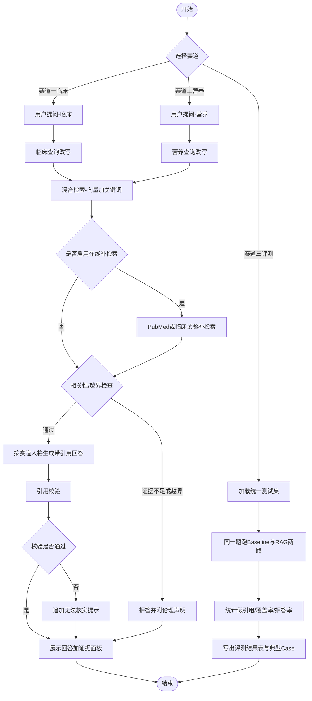
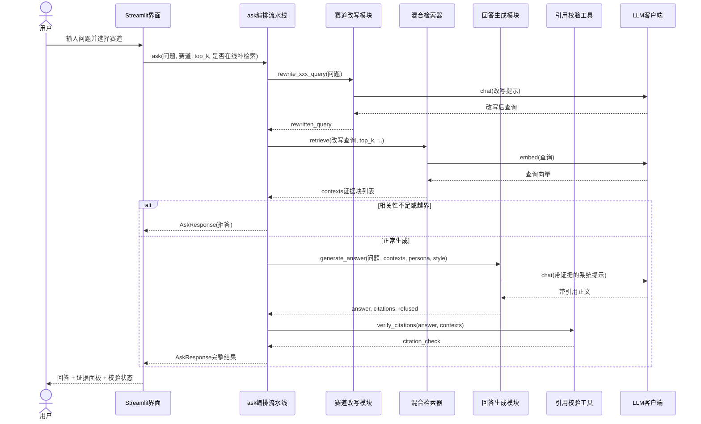
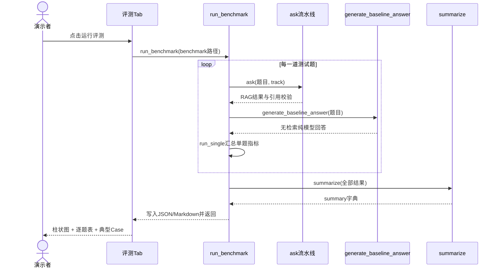
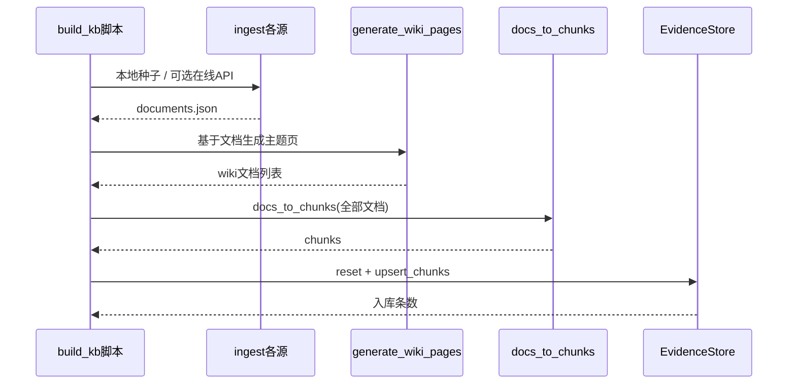
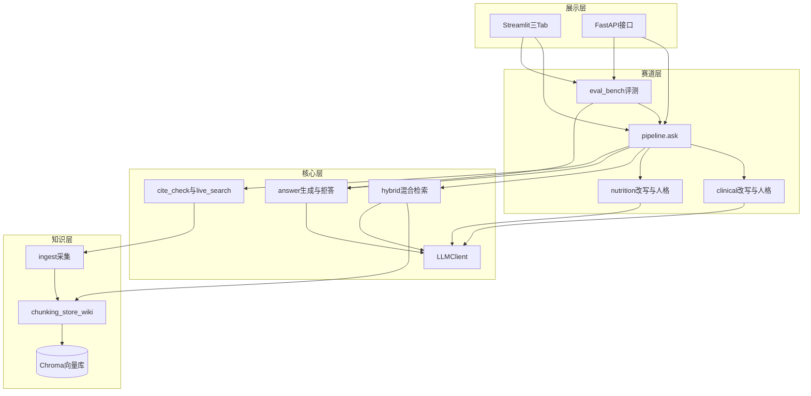

# 证据智能助手 MVP · 团队任务与架构说明（中文）

> 用途：给队员对齐「整体流程 / 时序 / 模块职责 / 函数接口」。  
> 约定：下文「已实现」= 仓库里已有可运行实现；「待完善」= 仅定义签名与注释，由对应同学补全函数体。

---

## 一、整体流程图（业务主链路）

### 离线准备子流程（建库，演示前执行一次）

---

## 二、时序图

### 2.1 赛道一 / 二：一次问答时序

### 2.2 赛道三：评测时序

### 2.3 建库时序（脚本）

---

## 三、整体架构图（模块 → 函数接口）

---

## 四、分层函数接口清单（对齐用）

说明格式：`函数名(参数) -> 返回值` + 作用。标注 **【已实现】** / **【待完善】**。

### 4.1 配置与模型 `src/config.py` / `src/models.py` / `src/llm.py`

| 函数/类 | 参数 | 返回值 | 作用 | 状态 |
|---|---|---|---|---|
| `get_settings()` | 无 | `Settings` | 读取环境变量与路径配置 | 已实现 |
| `LLMClient.chat(messages, temperature=0.2, max_tokens=2000)` | 对话消息列表等 | `str` | 调用大模型生成文本 | 已实现 |
| `LLMClient.embed(texts)` | `list[str]` | `list[list[float]]` | 文本向量化 | 已实现 |
| `get_llm()` | 无 | `LLMClient` | 单例获取客户端 | 已实现 |
| `EvidenceDoc` / `Chunk` / `Citation` / `AskRequest` / `AskResponse` | 字段见 models | Pydantic 模型 | 全链路统一数据结构 | 已实现 |

### 4.2 采集层 `src/ingest/`

| 函数 | 参数 | 返回值 | 作用 | 状态 |
|---|---|---|---|---|
| `save_docs(docs, path)` | 文档可迭代对象, 路径 | `int` 写入条数 | 保存 JSON | 已实现 |
| `load_docs(path)` | 路径 | `list[EvidenceDoc]` | 读取 JSON | 已实现 |
| `merge_docs(*doc_lists)` | 多组文档列表 | `list[EvidenceDoc]` | 按 doc_id 去重合并 | 已实现 |
| `ingest_pubmed(queries=None, retmax_per_query=15)` | 查询列表, 每查询条数 | `list[EvidenceDoc]` | PubMed 批量采集 | 已实现 |
| `search_pmids(query, retmax=20)` | 查询, 条数 | `list[str]` | 搜索 PMID | 已实现 |
| `fetch_pubmed_docs(pmids)` | PMID 列表 | `list[EvidenceDoc]` | 拉取摘要详情 | 已实现 |
| `ingest_clinicaltrials(conditions=None, page_size=10)` | 病种列表, 页大小 | `list[EvidenceDoc]` | 临床试验采集 | 已实现 |
| `search_trials(condition, page_size=20)` | 病种, 条数 | `list[EvidenceDoc]` | 单条件检索试验 | 已实现 |
| `ingest_europepmc(queries=None, page_size=12)` | 查询列表, 条数 | `list[EvidenceDoc]` | Europe PMC 采集 | 已实现 |
| `search_europepmc(query, page_size=15)` | 查询, 条数 | `list[EvidenceDoc]` | 单查询检索 | 已实现 |
| `ingest_local(include_seed=True)` | 是否含种子 | `list[EvidenceDoc]` | 本地种子/PDF/Markdown | 已实现 |
| `load_pdf_as_docs(pdf_path)` | PDF 路径 | `list[EvidenceDoc]` | PDF 转文档 | 已实现 |
| `normalize_evidence_level(raw_type, title)` | 原始类型, 标题 | `EvidenceLevel` | 统一证据等级推断 | **待完善** |
| `dedupe_by_doi_or_title(docs)` | 文档列表 | `list[EvidenceDoc]` | DOI/标题强去重 | **待完善** |
| `export_ingest_report(docs, out_path)` | 文档, 输出路径 | `Path` | 导出采集质量报告 | **待完善** |

### 4.3 知识库层 `src/kb/`

| 函数/方法 | 参数 | 返回值 | 作用 | 状态 |
|---|---|---|---|---|
| `docs_to_chunks(docs, max_chars=1200)` | 文档列表, 块长 | `list[Chunk]` | 切分并保留溯源字段 | 已实现 |
| `EvidenceStore.upsert_chunks(chunks, batch_size=32)` | 块列表, 批大小 | `int` | 向量入库 | 已实现 |
| `EvidenceStore.query(query, n_results=10, tag_filter=None)` | 查询, 条数, 标签 | `list[dict]` | 向量检索 | 已实现 |
| `EvidenceStore.all_chunks_for_bm25(limit=5000)` | 上限 | `list[dict]` | 供关键词检索语料 | 已实现 |
| `EvidenceStore.reset()` / `count()` | 无 | `None` / `int` | 重置库 / 计数 | 已实现 |
| `generate_wiki_pages(docs=None)` | 可选文档列表 | `list[EvidenceDoc]` | 生成主题知识页并落盘 | 已实现 |
| `rebuild_collection_from_processed(reset=True)` | 是否重置 | `int` 块数 | 仅从已处理文件重建索引 | **待完善** |
| `validate_chunk_traceability(chunks)` | 块列表 | `dict` 校验报告 | 检查块是否含 doc_id/url/title | **待完善** |
| `select_wiki_then_chunks(query, wiki_k=2, chunk_k=5)` | 查询, wiki条数, chunk条数 | `list[dict]` | 先 Wiki 后原文的检索策略 | **待完善** |

### 4.4 检索层 `src/retrieval/hybrid.py`

| 函数/方法 | 参数 | 返回值 | 作用 | 状态 |
|---|---|---|---|---|
| `HybridRetriever.retrieve(query, top_k=5, candidate_k=16, prefer_levels=None, boost_tags=None, use_llm_rerank=True)` | 见参数 | `list[dict]` 证据块 | 混合检索+可选重排+去重 | 已实现 |
| `score_evidence_priority(item)` | 单条证据 dict | `float` | 按指南>荟萃>RCT 计权 | 已实现 |
| `filter_by_year_range(items, year_from=None, year_to=None)` | 列表, 年份区间 | `list[dict]` | 按发表年过滤 | 已实现 |
| `explain_retrieval(query, items)` | 查询, 结果 | `dict` | 生成检索可解释说明（演示用） | 已实现 |

### 4.5 生成与工具 `src/generation/` + `src/tools/`

| 函数 | 参数 | 返回值 | 作用 | 状态 |
|---|---|---|---|---|
| `generate_answer(question, contexts, *, system_persona, answer_style)` | 问题, 证据, 人格, 风格 | `(answer:str, citations:list[Citation], refused:bool)` | 带引用生成或拒答 | 已实现 |
| `generate_baseline_answer(question, *, system_persona)` | 问题, 人格 | `str` | 无检索纯大模型回答 | 已实现 |
| `contexts_to_citations(contexts)` | 证据 dict 列表 | `list[Citation]` | 转引用对象 | 已实现 |
| `format_context_block(citations)` | 引用列表 | `str` | 拼进 Prompt 的证据块 | 已实现 |
| `extract_citation_indices(answer)` | 回答文本 | `list[int]` | 提取 [n] | 已实现 |
| `verify_citations(answer, contexts)` | 回答, 证据 | `dict` 校验结果 | 假引用/无效编号检测 | 已实现 |
| `strip_invalid_claims(answer, check)` | 回答, 校验结果 | `str` | 追加无法核实提示 | 已实现 |
| `search_pubmed(query, retmax=5)` | 查询, 条数 | `list[EvidenceDoc]` | 在线补检索文献 | 已实现 |
| `search_clinical_trials(condition, page_size=5)` | 病种, 条数 | `list[EvidenceDoc]` | 在线补检索试验 | 已实现 |
| `repair_answer_with_valid_cites(answer, contexts, check)` | 回答, 证据, 校验 | `str` | 校验失败时触发一次重写 | 已实现 |
| `compute_faithfulness_proxy(answer, contexts)` | 回答, 证据 | `float` 0~1 | 轻量忠实度代理指标 | 已实现 |

### 4.6 赛道层 `src/tracks/`

| 函数 | 参数 | 返回值 | 作用 | 状态 |
|---|---|---|---|---|
| `rewrite_clinical_query(question)` | 用户问题 | `str` | 临床检索向改写 | 已实现 |
| `rewrite_nutrition_query(question)` | 用户问题 | `str` | 营养口语归一改写 | 已实现 |
| `ask(question, track="clinical", *, top_k=5, use_live_tools=False, retriever=None, year_from=None, year_to=None, high_quality_only=False)` | 见参数 | `AskResponse` | 赛道一/二统一编排入口（年份过滤与高质量证据过滤通用） | 已实现 |
| `run_benchmark(path=None, out_dir=None)` | 题集路径, 输出目录 | `dict` | 跑完全部评测并落盘 | 已实现 |
| `run_single(item, *, retriever=None)` | 单题 dict | `dict` | 单题 Baseline+RAG | 已实现 |
| `summarize(results)` | 结果列表 | `dict` | 汇总指标 | 已实现 |
| `load_benchmark(path=None)` | 路径 | `list[dict]` | 读取 jsonl 题集 | 已实现 |
| `build_clinical_answer_outline(contexts)` | 证据列表 | `dict` | 临床结构化大纲（结论/证据等级/局限） | 已实现 |
| `build_nutrition_action_tips(contexts)` | 证据列表 | `list[str]` | 营养侧「你可以怎么做」要点 | 已实现 |
| `build_nutrition_answer_outline(contexts)` | 证据列表 | `dict` | 营养科普大纲（通俗结论/证据一句话/行动建议/何时就医） | 已实现 |
| `pick_typical_cases(results, n=3)` | 评测结果, 条数 | `list[dict]` | 自动挑选演示典型 Case | 已实现 |
| `export_human_rubric_template(out_path)` | 输出路径 | `Path` | 导出人工量表空表 | 已实现 |
| `compare_metric_delta(summary)` | 汇总字典 | `dict[str, float]` | 计算 RAG vs Baseline 指标差值 | 已实现 |

### 4.7 展示层 `src/app/`

| 函数 | 参数 | 返回值 | 作用 | 状态 |
|---|---|---|---|---|
| `api_ask(req: AskRequest)` | 请求体 | `AskResponse` | HTTP 问答 | 已实现 |
| `api_eval_run()` | 无 | `dict` | HTTP 触发评测 | 已实现 |
| `health()` | 无 | `dict` | 健康检查+伦理声明 | 已实现 |
| `render_assistant(track, sample_questions)` | 赛道, 示例题 | `None` | Streamlit 助手 Tab 渲染 | 已实现 |
| `render_ethics_banner()` | 无 | `None` | 统一伦理横幅组件 | 已实现 |
| `render_evidence_cards(contexts)` | 证据引用列表 | `None` | 独立证据卡片组件 | 已实现 |
| `render_anchored_evidence_cards(contexts)` | 证据引用列表 | `None` | 带锚点的证据卡片（回答内 [n] 可点击定位） | 已实现 |

---

## 五、建议任务分工（按模块认领）

| 角色 | 负责目录/接口 | 交付对齐点 |
|---|---|---|
| 队员A 数据 | `src/ingest/*` + 待完善三项 | 采集报告、证据等级、去重 |
| 队员B 知识库 | `src/kb/*` + 待完善三项 | Wiki优先检索、溯源校验、重建索引 |
| 队员C 检索生成 | `retrieval` + `generation` + `tools` | 可解释检索、忠实度、引用修复 |
| 队员D 赛道产品 | `tracks/*` + UI 组件待完善 | 临床大纲、营养行动建议、典型Case、量表 |
| 队员E 工程联调 | `app/*` + scripts + 演示脚本 | 接口联调、演示路径、报告材料 |

**接口对齐铁律：** 改函数签名前先改本文件第四节表格，并在对应业务 `.py` 文件末尾同步「【待完善】」签名注释（不再使用集中式 `interfaces_stubs.py`）。

### 待完善签名所在文件（分散认领）

> 当前所有原「待完善」项均已实现（含 `pick_typical_cases` / `export_human_rubric_template` /
> `compare_metric_delta` 与 `api_ask_batch`，详见 4.x 接口表状态列）。

---

## 六、关键返回结构速查

### `AskResponse` 字段

- `answer: str` 最终回答（含声明）
- `citations: list[Citation]` 生成所用引用
- `contexts: list[Citation]` 证据面板数据
- `refused: bool` 是否拒答
- `rewritten_query: str` 改写后查询
- `track: str` `clinical` / `nutrition`
- `citation_check: dict` 校验明细（含 `ok` / `fake_pmids` 等）

**`citation_check` 扩展字段（B 组）**

- `retrieval_explanation: dict` 检索可解释说明（why_selected/sources/notes）
- `clinical_outline: dict` 临床赛道结构化大纲（conclusion/evidence_levels/key_studies/limitations）
- `nutrition_outline: dict` 营养赛道科普大纲（conclusion/evidence_sentence/action_tips/when_to_see_doctor）
- `refusal_reason: str` 拒答原因标识（out_of_scope / off_domain / low_relevance / empty_context）
- `suggestions: list[str]` 拒答时给出的改进问法建议

### 检索返回的单条 `dict` 常用键

- `chunk_id`, `doc_id`, `title`, `text`, `source`, `year`, `url`, `tags`, `evidence_level`, `score`
