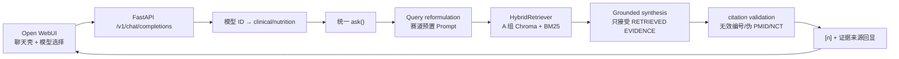

# 赛道一 / 赛道二统一助手实现记录

更新时间：2026-08-11  
开发分支：`Lee-Rewritten-little`

## 1. 范围与边界

本次在 B 组产品/问答编排基础上，融合了最新 `origin/main` 的 A 组数据与检索改进：

- A 组原始采集、切分、Chroma 接口和来源元数据继续作为事实来源；没有用 B 组逻辑覆盖 A 组采集结果。
- 对 `src/retrieval/hybrid.py`、`src/tracks/pipeline.py`、`src/tracks/nutrition.py` 等共享文件做兼容合并：保留 B 组统一 Prompt，同时接入中文 Bigram BM25、离线跳过伪向量和营养查询英文锚点。
- 已从最新 raw 数据完整离线重建 processed 数据与 Chroma，避免“raw 已更新但 RAG 仍读旧索引”。
- 赛道一和赛道二共用一个 `POST /ask` 问答契约；差异只由 track 配置、预置 Prompt 和安全规则决定。
- Open WebUI 作为主前端运行；FastAPI 提供 OpenAI-compatible 适配层，负责把模型选择映射到赛道一/二并返回可渲染的普通/SSE 对话结果。
- FastAPI 根路径的轻量 Web 前端与 Streamlit 仍保留为降级/课堂备用入口，不影响 Open WebUI 主路径。

## 2. B 组已完成内容

| 位置 | 完成内容 |
|---|---|
| `src/tracks/prompt_profiles.py` | 集中管理赛道一/二的 query reformulation、grounded system、synthesis 三层 Prompt；统一版本和前端公开配置。 |
| `src/tracks/clinical.py` / `nutrition.py` | 保留原有公开常量和业务规则，改为消费统一 Prompt 配置。 |
| `src/generation/answer.py` | 生成阶段接入统一 synthesis Prompt，保留 `[n]` 引用协议和伦理声明。 |
| `src/retrieval/hybrid.py` | 检索重排 Prompt 归位到 Prompt 配置模块，避免检索规则散落。 |
| `src/tracks/pipeline.py` | 两条赛道共用同一编排入口，响应增加 Prompt 栈版本与检索摘要。 |
| `src/app/api.py` | 新增统一 Web 入口、`/config/tracks`、`/kb/stats`、`/ask/batch`，以及 Open WebUI 所需的 `/v1/models`、`/v1/chat/completions`；保留原有 `/ask`、`/health`、`/eval/run`。 |
| `src/app/openwebui.py` | B 组 OpenAI-compatible 适配层：模型列表、赛道映射、文本/多模态文本提取、普通响应和 SSE 流式响应。 |
| `src/app/static/` | 无构建依赖的统一降级前端：赛道切换、示例问题、检索状态、回答、引用校验和证据来源侧栏。 |
| `src/app/ui.py` | Streamlit 从两个独立助手 Tab 收敛为统一赛道选择器，保留赛道三评测。 |
| `models.py` | 请求参数增加范围约束，响应增加 `prompt_version` 和 `retrieval` 摘要字段。 |

### 2.1 最新 A 组数据融合结果

本分支从 `origin/main` 融合了以下内容：

- 500 篇精选医学论文合集（`data/raw/collection_500.json`）。
- 三本营养书籍 OCR、核实文献和知识总结（`data/raw/literature.json`、`data/raw/local/`）。
- 18 条限钠/血压精品知识库（`data/raw/salt_bp_kb.json`），18/18 条均进入 processed，证据角色保留。
- A 组中文 Bigram BM25、正文关键词证据等级补全和离线模式跳过哈希向量噪声。

完整离线重建后的统计为：3,000 个 processed 文档、3,008 个含 Wiki 文档、11,401 个
Chroma chunks。前端模型列表、`/ask`、`/v1/chat/completions` 和 `[n]` 引用协议不变，
变化主要体现在召回证据更丰富、中文问题更容易命中英文文献和营养书籍。

## 3. 赛道契约

### 赛道一：临床证据

- 语言层：`指南 / RCT / 结局 / 适用人群`。
- 检索：优先 `guideline → meta → rct`，保留 Wiki 总览和其他研究作补充。
- 输出：`结论 → 证据概览 → 关键来源/研究 → 适用人群与局限`。
- 禁区：不替代临床决策，不给个体化处方、停药建议或剂量。

### 赛道二：健康营养

- 语言层：`研究提示 / 生活方式 / 局限`。
- 检索：沿用同一混合检索，额外提升饮食、地中海饮食、高血压、血脂和糖尿病标签。
- 输出：`通俗结论 → 研究提示 → 生活方式方向 → 边界与局限`。
- 禁区：不做个体化诊疗，不提供药物选择、服药方案或用药剂量；命中具体剂量问题时确定性拒答。

两条赛道共用的硬规则：只能使用已检索证据；事实性主张用 `[n]` 紧跟引用；证据不足时说明缺口；来源冲突时并列呈现；后端校验越界编号、PMID、NCT 和文档 ID。

## 4. Prompt 设计依据

采用 [RAG Prompt Engineering Guide (SurePrompts, 2026)](https://sureprompts.com/blog/rag-prompt-engineering-guide) 的三层分工：

1. **Query reformulation**：只负责把用户问题改成可检索查询，不回答问题。
2. **Grounded system**：定义角色、只用检索上下文、缺失信息、冲突证据和安全边界。
3. **Synthesis**：把带编号的证据块综合成符合赛道语言契约的回答。

在此基础上保留本项目已有的 `[n]` 协议，而不是让模型自由生成标题式引用：编号与前端证据卡片、后端 `verify_citations` 一一对应，便于现场核对。生成后仍会做 citation validation；Prompt 不是单独的安全证明。

## 5. 前端参考与本项目改造

主前端直接采用 Open WebUI 的现成界面，不在本项目重新仿制聊天 UI；本项目只保留协议适配和赛道业务逻辑：

- [Open WebUI](https://github.com/open-webui/open-webui) / [RAG 文档](https://docs.openwebui.com/features/chat-conversations/rag/)：直接使用其聊天、模型选择和回答渲染能力；后端按 OpenAI Chat Completions 协议提供结果。
- [Onyx](https://github.com/onyx-dot-app/onyx)：仅作为早期信息架构参考，不作为本次主前端运行时。

结合本项目要求后的改造放在后端协议和系统 Prompt：Open WebUI 的模型选择器中提供“赛道一 · 临床证据”和“赛道二 · 健康营养”，分别映射到同一条证据流水线的不同预置 Prompt。回答正文保留 `[n]` 引用和伦理声明，适配层还会把本次实际采用的证据标题、证据等级、年份和原文链接追加为“证据来源”，因此 Open WebUI 可以直接呈现可核对的 RAG 结果；`/ask` 仍提供结构化 `citations/contexts/retrieval/citation_check`，不改变主聊天协议。

### 5.1 RAG 的实际执行链



这里有意让 Open WebUI 的内置 RAG 不参与主链路：启动时的 `BYPASS_EMBEDDING_AND_RETRIEVAL=true`
只表示“不要让前端再做一次 Embedding 和检索”，并不绕过后端 `HybridRetriever`。如果前端
和后端同时检索，同一个问题会出现两套上下文，引用也无法保证对应 A 组知识库；当前设计
把检索、生成和校验集中在后端，才能保证 `[n]` 与当次证据一一对应。

当项目 `.env` 没有有效 `LLM_API_KEY` 时，`HybridRetriever` 仍会从现有 Chroma/BM25
返回证据并完成引用校验，只有 query 改写/重排/回答生成使用离线占位逻辑。配置真实
Claude/Anthropic 或 OpenAI-compatible LLM 后，同一条链路会把检索上下文注入 synthesis
Prompt，再由模型生成回答；不需要改前端或另写一套 RAG。Anthropic 模式默认不调用
不存在的 Claude Embedding，而是使用本地向量占位并跳过向量分支，继续使用中文 bigram
BM25，保证只填一个 AgentRouter token 也能完成 RAG。

### 5.2 LLM 调用位置

- 统一客户端：[`src/llm.py`](../src/llm.py) 的 `LLMClient.chat()` 和 `LLMClient.embed()`；
  `LLM_API_FORMAT=openai` 时调用 OpenAI Chat Completions，`anthropic` 时调用
  Anthropic Messages；Embedding 根据 `EMBEDDING_MODE` 选择远程 OpenAI-compatible 或本地
  哈希向量。
- 配置读取：[`src/config.py`](../src/config.py) 的 `Settings`，对应项目 `.env` 中的
  `LLM_API_FORMAT`、`LLM_API_KEY`、`LLM_BASE_URL`、`LLM_MODEL`、`EMBEDDING_MODE`、
  `EMBEDDING_MODEL`。
- 查询改写：[`src/tracks/clinical.py`](../src/tracks/clinical.py) 和
  [`src/tracks/nutrition.py`](../src/tracks/nutrition.py)。
- 检索重排：[`src/retrieval/hybrid.py`](../src/retrieval/hybrid.py) 的 `_llm_rerank()`。
- 证据回答：[`src/generation/answer.py`](../src/generation/answer.py) 的
  `generate_answer()`。
- 统一入口与前端适配：[`src/tracks/pipeline.py`](../src/tracks/pipeline.py) 的 `ask()`，
  以及 [`src/app/openwebui.py`](../src/app/openwebui.py) 的 `chat_completions()`。

### 5.3 AgentRouter 配置

项目根目录已经提供 [`.env.example`](../.env.example)（复制为 `.env`）；本地工作区也
预置了同样的无密钥模板。按 AgentRouter 官方指南，Claude 的 Anthropic Messages Base
URL 使用 `https://agentrouter.org`，不带 `/v1`；OpenAI-compatible 服务才使用带
`/v1` 的地址。当前示例将模型写成用户指定的 `claude-opus-5`，但模型 ID 受 API Key
绑定的资源池影响，若返回 `model not found`，按官方建议查询 `/v1/models` 后只修改
`LLM_MODEL`。

```bash
cd /Users/quentincrane/Documents/第三期/Third-session/evidence-assistant-mvp
cp .env.example .env  # 如果本地尚未有 .env
# 只编辑 LLM_API_KEY=...
```

如果需要切换供应商，仍只编辑 `.env` 中的 `LLM_API_FORMAT`、`LLM_BASE_URL`、
`LLM_MODEL`；这不会影响 Open WebUI，也不会改变赛道一/二的预置 Prompt 和后端 RAG 编排。

## 6. 可复现命令

```bash
cd /Users/quentincrane/Documents/第三期/Third-session/evidence-assistant-mvp

# 项目后端 Conda 环境（已准备好的环境可跳过创建）
conda create -y -p /Users/quentincrane/conda_envs/evidence_mvp python=3.12 pip
conda run -p /Users/quentincrane/conda_envs/evidence_mvp \
  python -m pip install -r requirements.txt

# 融合最新 A 组 raw 数据并重建 processed + Chroma（离线，不访问外网）
conda run --no-capture-output -p /Users/quentincrane/conda_envs/evidence_mvp \
  python scripts/build_kb.py --skip-live --stats

# 终端 A：启动后端
conda run --no-capture-output -p /Users/quentincrane/conda_envs/evidence_mvp \
  uvicorn src.app.api:app --host 127.0.0.1 --port 8000

# 终端 B：准备主前端（只需执行一次）
conda create -y -p /Users/quentincrane/conda_envs/open_webui python=3.11 pip
conda run --no-capture-output -p /Users/quentincrane/conda_envs/open_webui \
  python -m pip install open-webui

# 终端 B：启动 Open WebUI；首次打开需在其本地页面完成管理员初始化
# 首次启动/曾启动过默认 embedding 时保留 RESET_CONFIG_ON_START；初始化完成后可去掉
OPENAI_API_BASE_URL=http://127.0.0.1:8000/v1 \
OPENAI_API_KEY=evidence-local \
DATA_DIR=/Users/quentincrane/conda_envs/open_webui_data \
RESET_CONFIG_ON_START=true \
RAG_EMBEDDING_ENGINE=openai \
RAG_EMBEDDING_MODEL=evidence-embedding \
BYPASS_EMBEDDING_AND_RETRIEVAL=true \
conda run --no-capture-output -p /Users/quentincrane/conda_envs/open_webui \
  open-webui serve --host 127.0.0.1 --port 8080

# 备用：FastAPI 证据台 http://127.0.0.1:8000/
# 备用：Streamlit 课堂界面
conda run --no-capture-output -p /Users/quentincrane/conda_envs/evidence_mvp \
  streamlit run src/app/ui.py
```

可用接口：

```bash
curl http://127.0.0.1:8000/health
curl http://127.0.0.1:8000/config/tracks
curl http://127.0.0.1:8000/kb/stats
curl -X POST http://127.0.0.1:8000/ask \
  -H 'Content-Type: application/json' \
  -d '{"question":"地中海饮食对心血管风险有什么证据？","track":"nutrition","top_k":5}'

curl http://127.0.0.1:8000/v1/models
curl -N http://127.0.0.1:8000/v1/chat/completions \
  -H 'Content-Type: application/json' \
  -H 'Authorization: Bearer evidence-local' \
  -d '{"model":"evidence-nutrition","stream":true,"messages":[{"role":"user","content":"地中海饮食对心血管风险有什么研究提示？"}]}'
```

## 7. 验证记录

- `conda run -p /Users/quentincrane/conda_envs/evidence_mvp python -m compileall -q src tests scripts`：通过。
- `conda run -p /Users/quentincrane/conda_envs/evidence_mvp python -m unittest -v tests.test_rag_contract`：6 项通过，覆盖 Prompt 注入、检索结果传递、引用校验、Open WebUI 来源回显、中文 Bigram/查询锚点和最新 Chroma 规模。
- 最新 A 组离线重建：3,000 processed 文档、11,401 chunks、3,008 覆盖文档；临床限钠和营养膳食纤维问题均实际召回证据，引用校验 `ok=true`。
- `git diff --check`：通过。
- A 组融合审计：最新 `origin/main` 的 raw/processed 数据和采集增强已合入；B 组 Open WebUI、统一 Prompt 与 API 契约仍保留。
- Open WebUI 适配器烟测：模型列表、普通 Chat Completions、SSE 流式回答和文本数组消息均通过。
- 真实离线知识库链路烟测：赛道一/二均能返回回答；已将本地 Chroma 读取产生的测试目录移出仓库，未进入提交。
- Open WebUI 安装依赖体量较大，使用独立 Conda 环境，不混入项目后端或 A 组环境。
